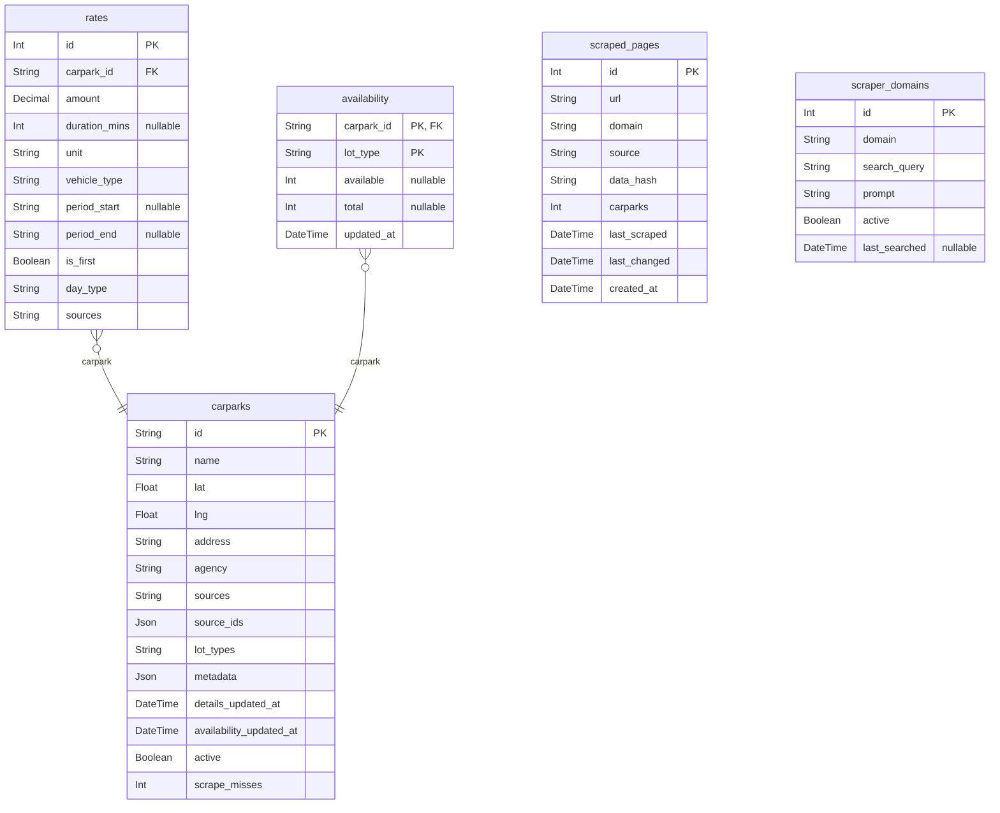

```mermaid
erDiagram

  "carparks" {
    String id "PK"
    String name 
    Float lat 
    Float lng 
    String address 
    String agency 
    String sources 
    Json source_ids 
    String lot_types 
    Json metadata 
    DateTime details_updated_at 
    DateTime availability_updated_at 
    Boolean active 
    Int scrape_misses 
    }
  

  "rates" {
    Int id "PK"
    String carpark_id "FK"
    Decimal amount 
    Int duration_mins "nullable"
    String unit 
    String vehicle_type 
    String period_start "nullable"
    String period_end "nullable"
    Boolean is_first 
    String day_type 
    String sources 
    }
  

  "availability" {
    String carpark_id "PK, FK"
    String lot_type "PK"
    Int available "nullable"
    Int total "nullable"
    DateTime updated_at 
    }
  

  "scraped_pages" {
    Int id "PK"
    String url 
    String domain 
    String source 
    String data_hash 
    Int carparks 
    DateTime last_scraped 
    DateTime last_changed 
    DateTime created_at 
    }
  

  "scraper_domains" {
    Int id "PK"
    String domain 
    String search_query 
    String prompt 
    Boolean active 
    DateTime last_searched "nullable"
    }
  
    "rates" }o--|| carparks : "carpark"
    "availability" }o--|| carparks : "carpark"
```
